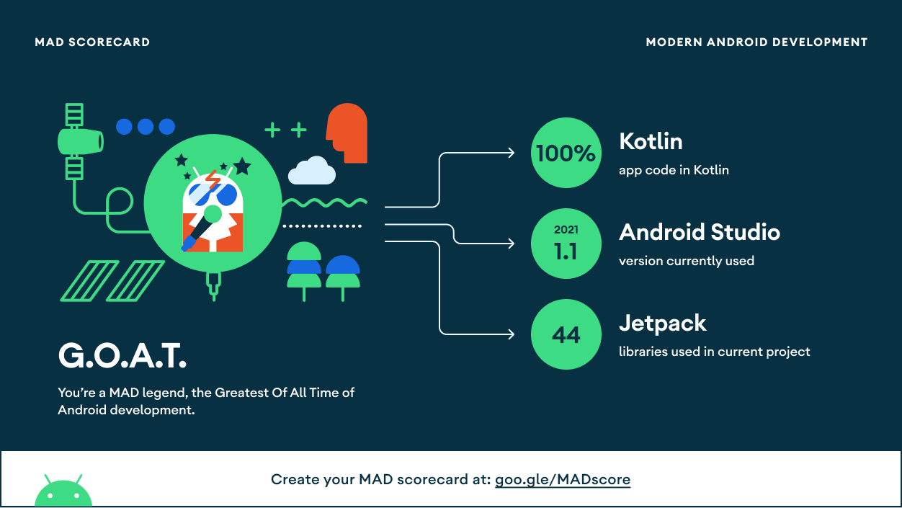
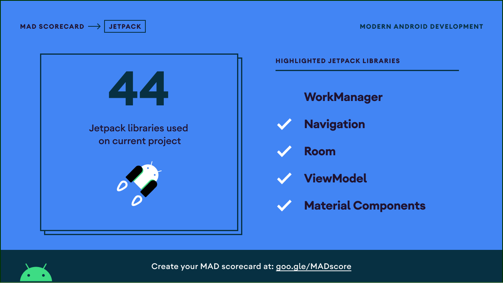
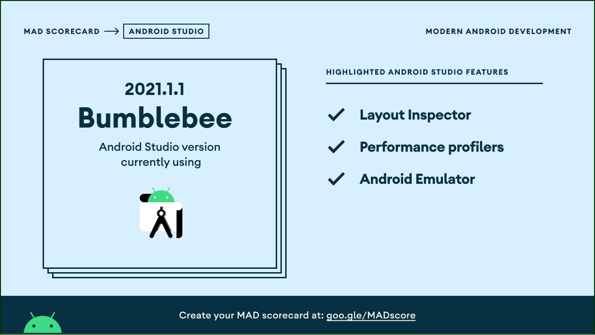

# Agree Ecosystem Repositories

## > Prerequisite
* Android Studio >= BumbleBee 2021.1.1 Patch 2
* JDK >= JDK 11
* Git Client and Terminal, If You use Windows you can using [Gitbash](https://git-scm.com/downloads)
* Android Version >= Lollipop 5.1.1 SDK 22

## > Initial Configuration
* Open your global gradle.properties directory on:
  * For Windows : `C:\Users\<you>\.gradle\gradle.properties`
  * For Mac/Linux : `/Users/<you>/.gradle/gradle.properties`
* Create global gradle.properties if you don't already have it or open it if you already it :
  * If Using Mac / Linux Using Terminal, If Using Windows Please using Gitbash and open it on directory above
      ```
          touch gradle.properties //Skip this step if you already have it
          echo "nexus_username=??" >> gradle.properties && echo "nexus_password=??" >> gradle.properties
      ```
    > for credentials please ask Maintener to replace `??` with credentials
* Open Project in Android Studio and Make Sure you have internet connection for first build

## > Contribution
* Please Fork this Project first
* Clone your private repository on your computer
* Open terminal on your project directory
* Add Upstream Remote Git on your project :
    ```
    git remote add upstream ssh://git@gitlab.playcourt.id:31022/agree-logtan/mobile-services/agree-logtan-mobile-ecosystem.git
    ```

  > we highly recommend using ssh instead of using https, you can setup ssh with this [Guide](https://docs.gitlab.com/ee/user/ssh.html)
* Pull Upstream latest upstream code :
    ```
    git pull upstream
    ```
* Create Branch in origin repo's with rule :
  * hotfix-{purpose} if you work on hotfix
  * bugfix-{purpose} if you work on bugfix
  * feature-{purpose} if you work on feature / sprint
* And Let's Marge Request to develop branch and Assign to Current Maintener : @telkomdev-abdul

## > Documentation
[Agree Ecosystem Documentation](https://agree-ecosystem-dev.web.app/)

## ❯ Mad Scorecard








